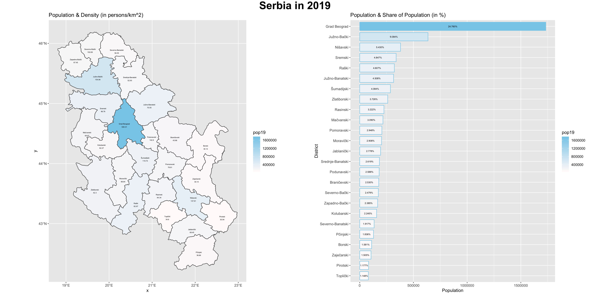
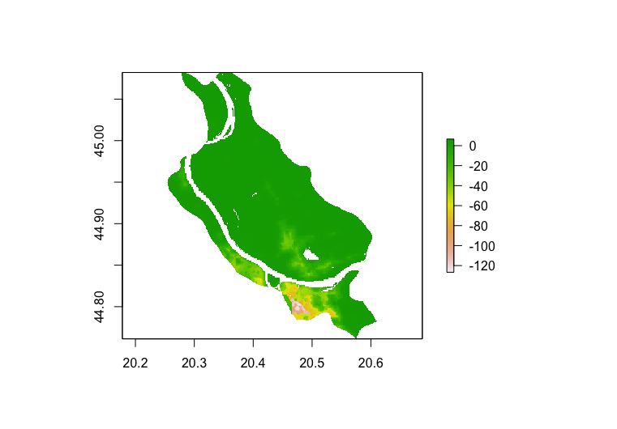

# Final Project: Analysis of the Human Development in Serbia 

Jonghyuck (David) Roh 

## Administrative Units, Population, and Description 

Serbia is a country located between Central and Southeast Europe in the southern Pannonian Plain and the central Balkans. It has a population of about 6.982 million and a GNI per capita of 16,540 PPP dollars, making a low-middle income country. I will be examining the overall human development in Serbia throughout this project. 

Serbia consists of three administrative subdivisions: adm0 - the international border, adm1 - the districts, and adm2 - the municipalities. The image below labels the international border along with the two adminstrative subdivisions of Serbia. The skyblue lines represent the international border while the golden lines represent the first administrative subdivisions. The second subdivisions have been labeled with the color black. 

Serbia can now be examined further by looking at its subdivisions. We will start by looking at its first administrative subdivisions, districts. 

The plot above shows the population for the first administrative subdivisions (districts) of Serbia. The color skyblue represents the most populated area while the color snow represents the least populated area of Serbia. 

We can also examine the population density of each of the first administrative subdivisions. I have created a barplot labeling the population densities of the districts of Serbia and combined the barplot with the previous plot below. 

## Investigating Land Use and Land Cover 

Now that we have examined Serbia's first administrative subdivisions, we will move on to the second administrative subdivisions of Serbia, municipalities. 

### Acquiring, Modifying and Describing the Data

The image below is a histogram that represents the population counts of each 2nd administrative subdivisions of Serbia. The log function was used to scale the population values down, as without it, the population values would be too big on the x-axis.

The image below is a line plot that represents the population density for each 2nd administrative subdivisions of Serbia. It also used the log function to scale the population values down. You can notice how it has a similar overall shape when compared to the histogram above. 

The image below is a combined plot that shows both the histogram of the population of the 2nd administrative subdivisions of Serbia and the line plot of the population density.

The image below is a linear model that shows the relationship between two sets of variables. This model shows the regression between the data from the two sets of variables. For this model, I looked at the regression model using dst190 (urban areas) and dst200 (bare areas) as the independent variables (predictors) and the population of Serbia in 2019 as the dependent variable (response). You can see that although most are grouped together, there are still multiple outliers in the model that are located very far away from the rest of the values. 

### Modeling & Predicting Spatial Values

After looking at the general overview of the population and the population densities of all of the municipalities of Serbia, we will now focus on two municipalities of Serbia called Novi Beograd and Palilula. 

The image below is the population plot for Novi Beograd, Serbia produced using the raster data from the WorldPop website. 

 

The image below is the difference plot that shows the difference between the predicted population value and the actual population value of Novi Beograd, Serbia. You can see that for the right half of Novi Beograd, there seems to be a tendency to underpredict the population values. 

The image below is the 3D representation of the spatial values for Novi Beograd, Serbia. 

 

The image below is from placing the difference plot of Novi Beograd on top of the Open Street Map. Looking at the image, you can see that the parts that held more errors are more to the right side of Novi Beograd. You can also see that those parts have more buildings and roads, being closer to the urban portion of the country.  

 

The image below is the population plot for Palilula, Belgrade, Serbia.  

 

The image below is the differnce plot that represents the difference between the predicted population values and the actual population values of Palilula, Belgrade, Serbia. You can see that for the most part, it is pretty accurate. However, as it gets to the southern portion of the city, there seems to be a growth of underprediction for the population. 

 

The image below is the 3D representation of the spatial values for Palilula, Belgrade, Serbia. 

 

The image below is from placing the difference plot of Palilula on top of the Open Street Map. Similar to Novi Beograd, the areas that had more error between the predicted values and the actual values were areas that were closer to the urban areas. 

 

## Accessibility to Health Care Through Transportation Facilities

To examine the accessibility of health care facilities and transportation facilities, we will examine the area of Bor, which has a population of about 86,000. I decided to shift my focus to the area of Bor, as the previous areas of focus had populations that were too large for my computer to process. Bor has 9 total urban areas, and the main urban area of Bor is called Bor City, which has a population of about 10,000. I have produced a plot labeling the urban areas, the road ways, and the health care facilities in Bor below. 

The lightblue polygons represent urban areas, the red lines represent the main primary roads (highways that connect to other districts), the orange lines represent the secondary roads, and the purple lines represent the tertiary roads (which connect to other areas within Bor). Furthermore, the white points represent hospitals and the lightblue point represents a clinic. You can observe that there is actually only one hospital located in the biggest urbanized area of Bor, and there are only one hospital and one clinic located near Bor. This is a huge problem since everyone in Bor would either have to go to the hospital located in the one urbanized area in Bor or travel to other towns to receive health care. 

I also rendered in the topography of Bor in the image below. 

 

I made one change in the labeling of the road networks. Now, the road networks are represented by the red lines that run through the plot, and the thick lines represent primary roads while the thinner lines represent secondary and tertiary roads.

From this image, you can see that topography had a big impact on the development of urban areas as all the urban areas are located on the flatter areas of the municipality. You can see that there are no urban areas in areas of high elevation. 

Topography also appears to have impacted the development of transportation facilities because although the secondary and tertiary roads that connect areas within the adm2 region run through mountainous regions, the main primary roads such as highways that connect to other districts only run through areas that are relatively flat. 

Although there is only one healthcare facility that is located within the borders of the municipality of Bor, you can see that it is located within the urban area of Bor City which has relatively low elevation. We can assume that even if there were more healthcare facilities, they would be centered around flatter areas and near urban areas. 

Overall, Bor is still an underdeveloped region, as its mountainous topography makes it difficult to produce and develop human settlements and infrastructure. The road networks of Bor should be developed further as improving the main roads (highways) that connect the area of Bor to other districts can boost the overall economy of the area. There is a huge underdevelopment in terms of healthcare facilities, as there is only one hospital in the whole region of Bor. Although there are secondary and tertiary roads that run to the hospital from different regions within Bor, there must still be further development in the healthcare facilities to make healthcare more easily accessible to everyone within Bor. This is even more emphasized by the fact that Bor's economy is centered around its mining operations that take place in the mountains of Bor. By having more healthcare facilities near the mountainous areas, the mining conditions of the people of Bor can also be indirectly improved. 

