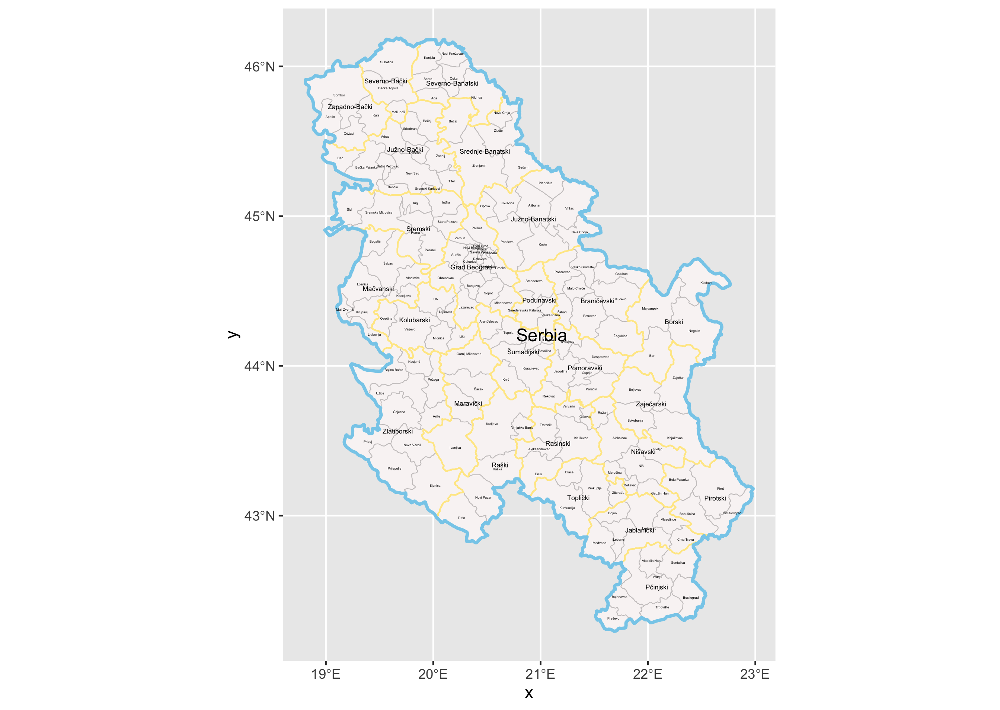
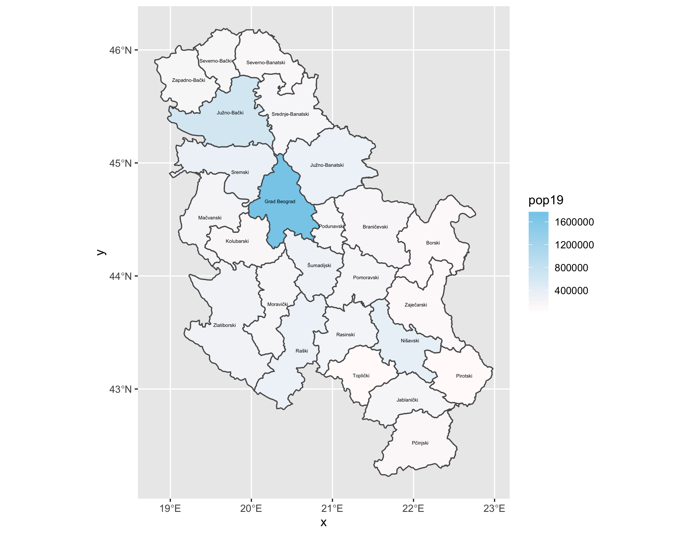

# Project 1: Administrative Units, Population and Description

Jonghyuck (David) Roh 

## Projecting, Plotting and Labelling Administrative Subdivisions 

The image below labels the international border  along with the two adminstrative subdivisions of Serbia. The international border is labeled with the color skyblue, while the first adminstrative subdivisions, districts, are labeled with the color gold. The second subdivisions of Serbia are the towns and the municipals and are labeled with the color black. 

 

While working on this plot, I came across several different problems. The first was when I tried to import the shapefiles into RStudio to create the simple feature class object for the international border. This problem was caused because I set the working directory to my Wicked Problems folder after putting the shapefiles into a Data subfolder within my Wicked Problems folder. Another problem that I encountered was when I tried labeling the different subdivisions of Serbia. When I tried to set the label using NAME_1, it labeled every subdivision of the plot with NAME_1 instead of their actual names. I received help from my group members and solved it by using a data set. Overall, I was able to learn several new things regarding Serbia and using RStudio. 

## Extracting Populations from a Raster and Aggregating to Each Unit

This plot labels the population for the first administrative subdivision (district) of Serbia. The color skyblue represents the most populated area while the color snow represents the least populated area of Serbia. 

Compared to the previous part of the project, I was able to get through this part without any major problems. The only "challenge" was deciding on the colors of the representation. I first used the colors red and yellow because of their common usage as indications of population. However, when I put the plot with the first plot, the colors were drastically in contrast with each other. I ended up using the same two colors that I had used for the first plot because I thought this resulted in a better presentation. 

## Creating a Geometric Bar Plot with Your Simple Feature Object

This plot combines the second plot with a barplot that labels the population density of the first subdivision (district) of Serbia. 

I encountered several problems on this part of the project. The first problem was when I tried to label the barplots with the percentage values that represent population density. RStudio had trouble recognizing the function percentage. I found out that this problem was because I had not loaded up the scales package. Another problem was when I tried to title the two plots. For some reason, the title of the two plots were not showing up in the final plot. This problem was only solved when I restarted RStudio and tried doing everything again from the beginning. After working on this plot, I realized how densely populated the capital, Belgrade, was compared to the other districts. Overall, I really enjoyed working on this project as a whole. At first, I was struggling to even get past one step without asking for help. In the end, however, I was able to solve and get through the different challenges I encountered. It was really nice to see this progression in my work. 
