# Project 2: Investigating Land Use and Land Cover

Jonghyuck (David) Roh 

## Acquiring, Modifying and Describing the Data

The image below is a histogram that represents the population counts of each 2nd administrative subdivisions of Serbia. To create the histogram, I added a column to my adm2 object that had the pop19 values for each adm2s of Serbia. Then, geom_histogram was used to actually produce the histogram as a representation. The log function was used to scale the population values down, as without it, the population values would be too big on the x-axis.

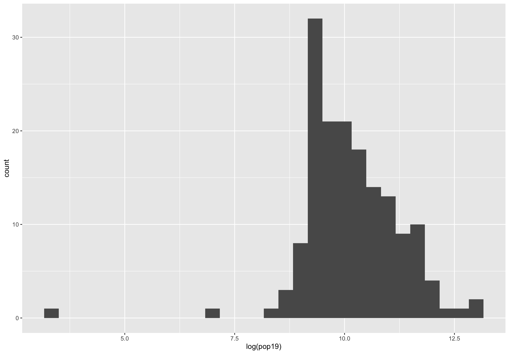

The image below is a line plot that represents the population density for each 2nd administrative subdivisions of Serbia. It also used the log function to scale the population values down. You can notice how it has a similar overall shape when compared to the histogram above. 

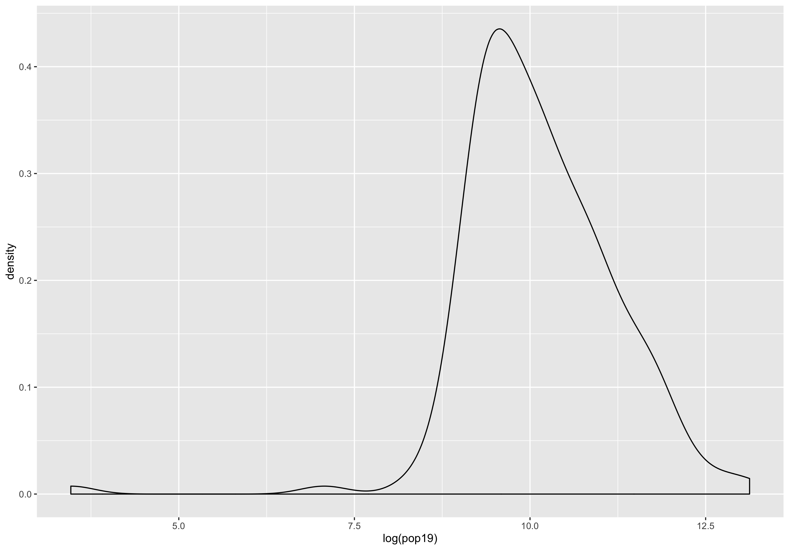

The image below is a combined plot that shows both the histogram of the population of the 2nd administrative subdivisions of Serbia and the line plot of the population density.

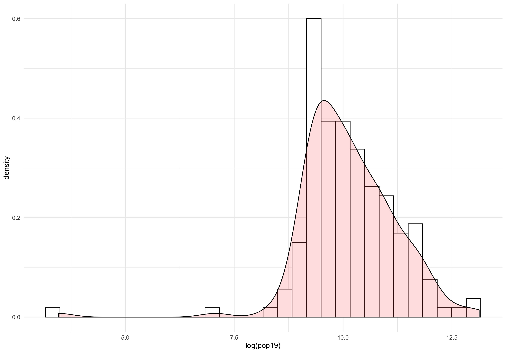

The image below is similar to the image above, but instead of using a histogram of the population, it uses a histogram that shows the counts of the night time lights for each 2nd administrative subdivisions of Serbia and combines it with the density line plot. 

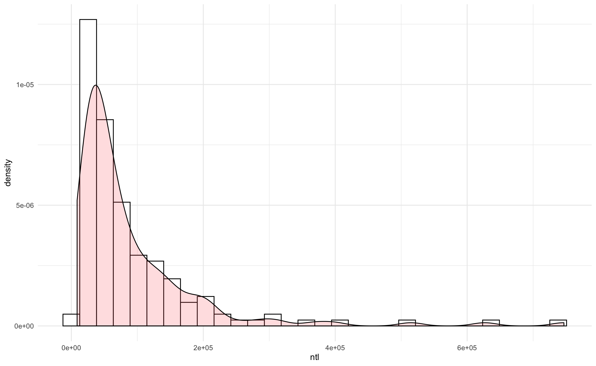

The image below is a linear model that shows the relationship between two sets of variables. This model shows the regression between the data from the two sets of variables. For this model, I looked at the regression model using dst190 (urban areas) and dst200 (bare areas) as the independent variables (predictors) and the population of Serbia in 2019 as the dependent variable (response). You can see that although most are grouped together, there are still multiple outliers in the model that are located very far away from the rest of the values. 

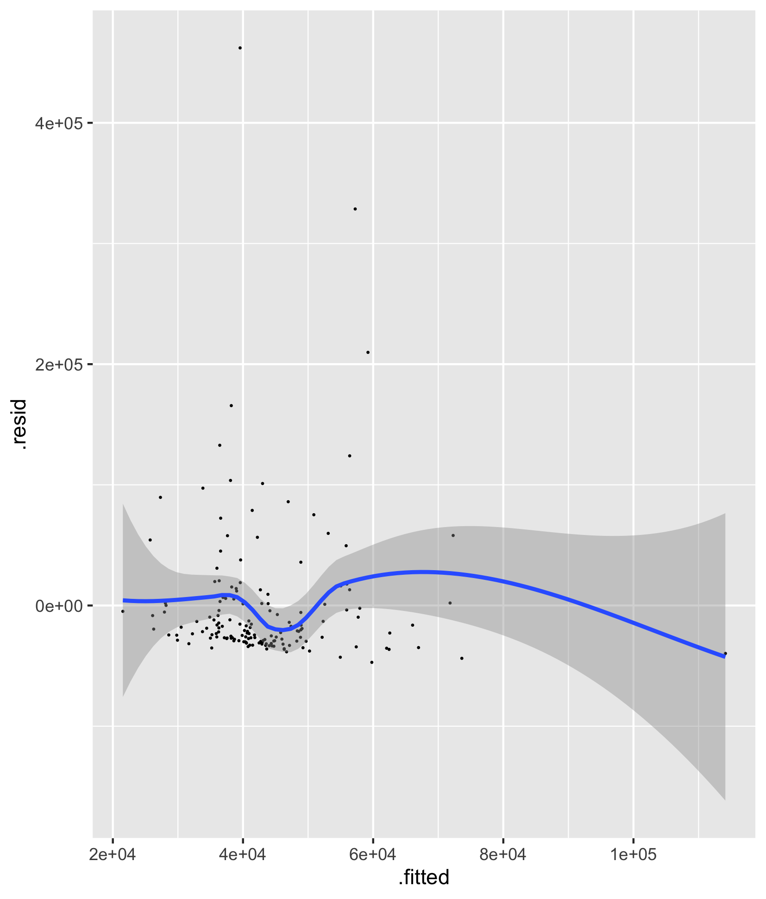

The image below is similar to the one above, but it uses different variables for its dependent variables. It uses the water data and dst011 (herbacious cover) as the independent variables (predictors) and the population of Serbia in 2019 as the dependent variable (response). You can see a similar pattern to the model that used urban and bare areas as predictors. 

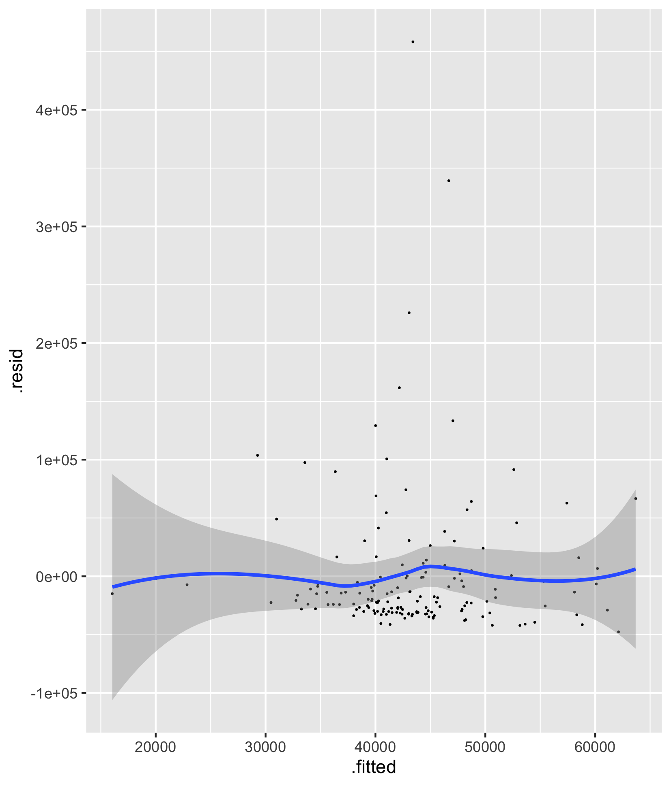

## Modeling & Predicting Spatial Values

The image below is the population plot for Novi Beograd, Serbia. It used the raster data from the WorldPop website. 

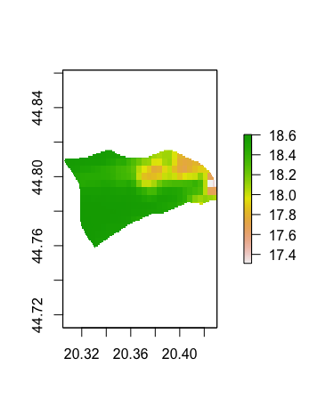 

The image below is the difference plot that shows the difference between the predicted population value and the actual population value of Novi Beograd, Serbia. You can see that for the right half of Novi Beograd, there seems to be a tendency to underpredict the population values. 

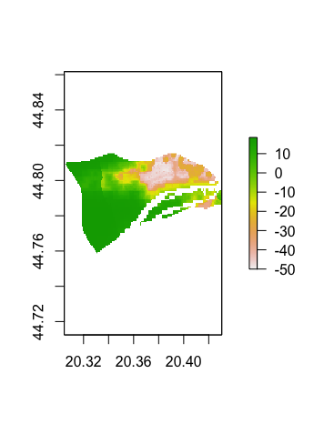

The image below is the 3D representation of the spatial values for Novi Beograd, Serbia. 

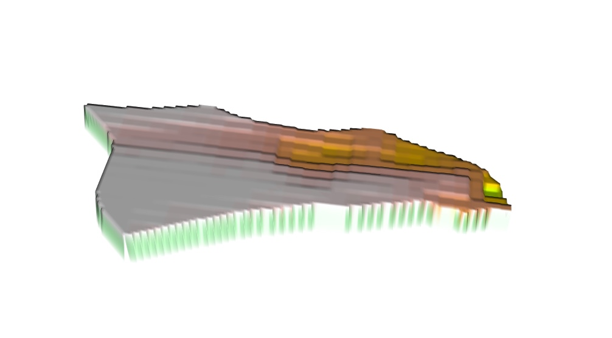 

The image below is from placing the difference plot of Novi Beograd on top of the Open Street Map. Looking at the image, you can see that the parts that held more errors are more to the right side of Novi Beograd. You can also see that those parts have more buildings and roads, being closer to the urban portion of the country.  

 

The image below is the population plot for Palilula, Belgrade, Serbia.  

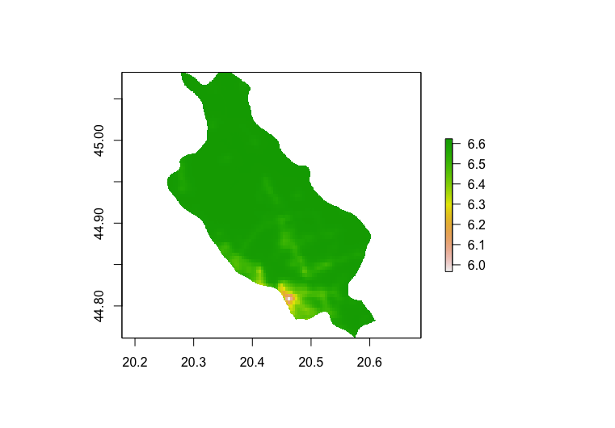 

The image below is the differnce plot that represents the difference between the predicted population values and the actual population values of Palilula, Belgrade, Serbia. You can see that for the most part, it is pretty accurate. However, as it gets to the southern portion of the city, there seems to be a growth of underprediction for the population. 

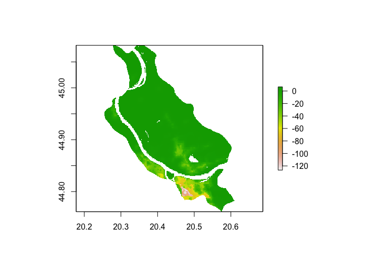 

The image below is the 3D representation of the spatial values for Palilula, Belgrade, Serbia. 

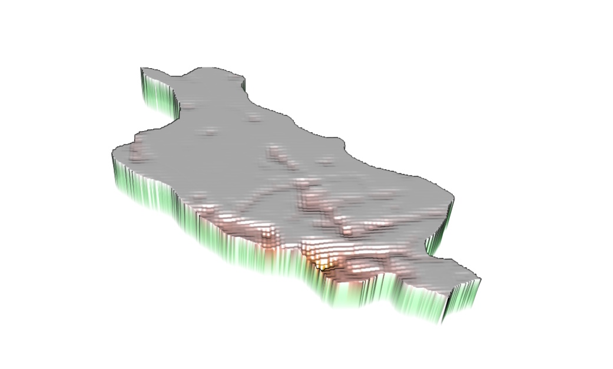 

The image below is from placing the difference plot of Palilula on top of the Open Street Map. Similar to Novi Beograd, the areas that had more error between the predicted values and the actual values were areas that were closer to the urban areas. 

 

## Problems/Difficulties That I Ran Into 

The main problem that I ran into for this project was the fact that until now, when using the pop19 data, I have only done it for the adm1s. For part 1 and 2, we had to use the pop19 values of the adm2s. At first, I did not know what was wrong when it said that the variable was missing for adm2s. By the time I worked on project 2, I forgot how I loaded the pop19 values for the adm1s. So, I had to go back to project 1 and repeat all the steps for loading the pop19 values for adm1 but using adm2s instead. Once I did that, I was able to continue working on the project. 

## Things That Could Be Improved 

The main thing that could be improved is using pop15 values instead of pop19 values for the part 1 of this project. The main reason is because all the other covariate data that I used for Serbia in part 1 was based on the 2015 data. So, it could be more accurate if I used 2015's population values instead of 2019's. 

