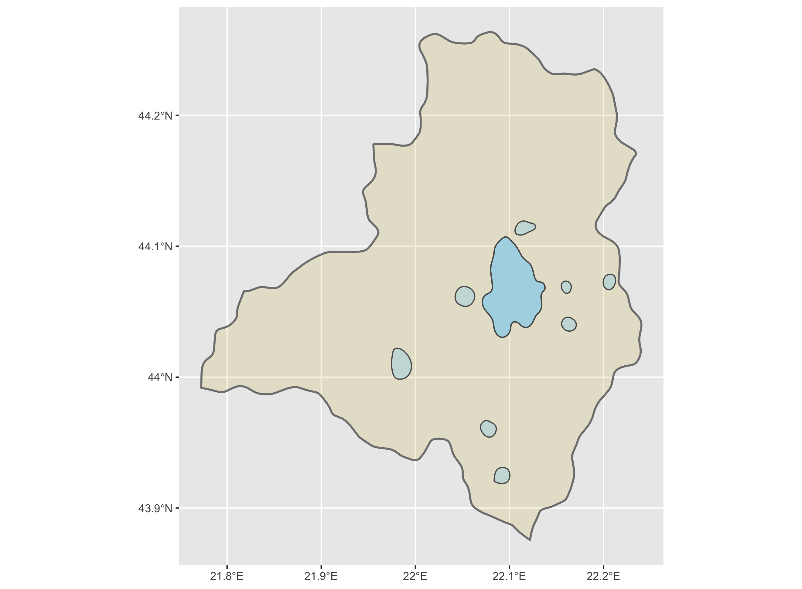
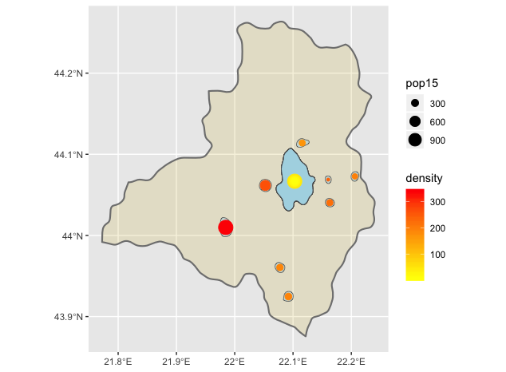
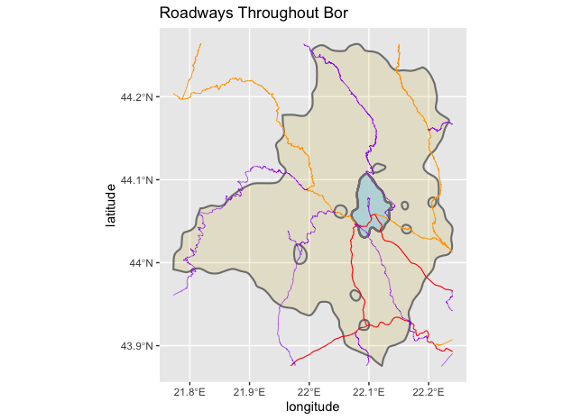
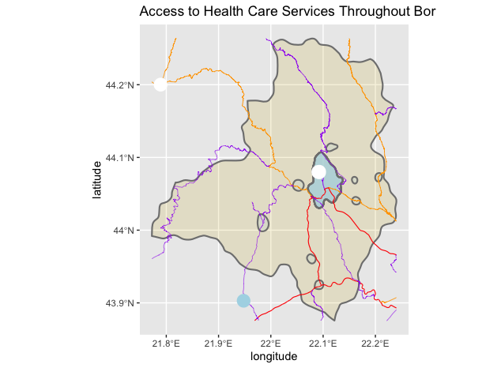
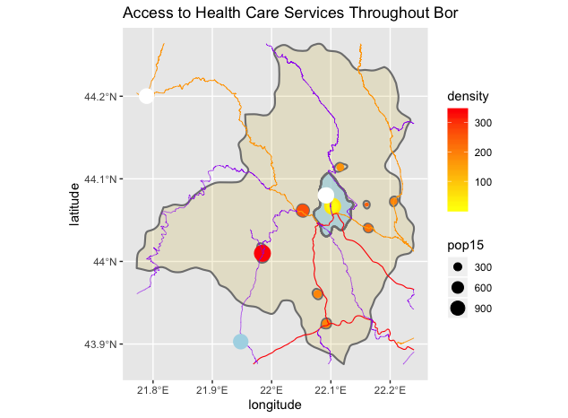

# Project 3: Accessibility to Health Care Through Transportation Facilities

Jonghyuck (David) Roh 

## De Facto Description of Human Settlements and Urban Areas

For project 3, I chose to investigate the urban areas of a small adm2 subdivision (town) of Serbia called Bor. Bor has a population of about 120,000 and is located on the eastern side of Serbia. The image below shows the urban areas of Bor, which are represented by the lightblue polygons. Due to how small the town is, there are only a few urbanized areas and the sizes of most of these urbanized areas are relatively small.

 

On top of the image above, I added points which the size reflects the population and the color reflects the population density of the area. The resulting image is shown below.

You can observe that although the biggest urban area of Bor has one of the biggest point (bigger population residing in that urban area), it also has a very low population density due to the size of the area (represented by the yellow point). You can also see that the leftmost urbanized area has the biggest population, but because of the small size of the area, it also has the biggest population density. Other than these two areas with extreme population densities, all of the other urbanized areas has a relatively small population with a small population density. 

## Adding Transportation Facilities & Health Care Services 

Following through last two images, I have located and labeled the road networks that run through Bor. The resulting image is shown below. 

The red lines represent the main primary roads, the orange lines represent the secondary roads, and the purple lines represent the tertiary roads. The tertiary roads are roads that have low to moderate traffic, so these could be roadways between smaller subdivisions such as villages and towns. The secondary and primary roads are the main roads such as highways. You can see that although the primary roads only connect to the more populated and big urban area of Bor and to the other cities, inside of Bor, secondary and tertiary roads connect to more areas, as Bor is composed of mainly small urbanized and non-urbanized areas.

In addition to the road network, I have also identified the health care facilities that are located in Bor. The resulting image is shown below. 

The white points represent hospitals and the lightblue point represents a clinic. You can observe that there is actually only one hospital located in the biggest urbanized area of Bor, and there is only one hospital and one clinic located near Bor. This is a huge problem since everyone in Bor would either have to go to the hospital located in the one urbanized area in Bor or travel to other towns to receive health care. 

I have combined the previous image with the image used in the first part of the project below. 

## Problems Encountered During the Project

The only problem I encountered during this project was finding the actual data for the road networks and the health care facilities. The HDX website only had the health care facilities data of Serbia, so I had to receive the road networks data from Professor Frazier. The health care facilities data of Serbia from the HDX website also had an error whenever I tried to download it, so I had to find it from a different website called healthsites.io. 

