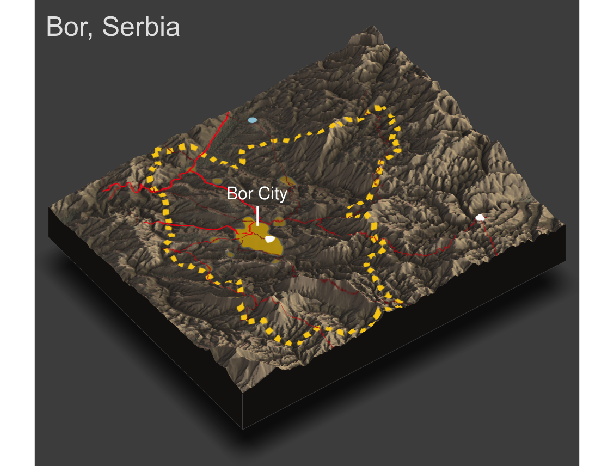

# Project 4: Further Analysis of Infrastructure and Services 

Jonghyuck (David) Roh 

## Rendering Topography

I investigated the adm2 region of Bor which is located on the eastern portion of Serbia. Bor has a population of about 86,000. The name of the main urban area of this region is Bor City, which has a population of about 10,000. For this project, I rendered in the topographical data of this specific region and labeled the urban areas, road networks, and healthcare facilities of this region. The road networks are represented by the red lines that run through the plot, and the thick lines represent primary roads while the thinner lines represent secondary and tertiary roads. Furthermore, the white dots represent hospitals while the blue dot represents a clinic. The produced image is shown below.  

 

From this image, you can see that topography had a big impact on the development of urban areas as all the urban areas are located on the flatter areas of the municipality. You can see that there are no urban areas in areas of high elevation. 

Topography also appears to have impacted the development of transportation facilities because although the secondary and tertiary roads that connect areas within the adm2 region run through mountainous regions, the main primary roads such as highways that connect to other districts only run through areas that are relatively flat. 

Although there is really only one health care facility that is located within the borders of the municipality of Bor, you can see that it is located within the urban area of Bor City which has relatively low elevation. We can assume that even if there were more health care facilities, they would be centered around flatter areas and near urban areas. 

Before doing this project, I never really considered topography to have such a huge impact, but looking at the result, I realized how much of an impact topography can have on human development. 
